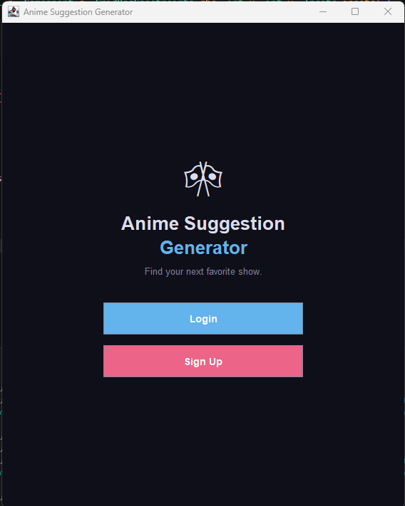
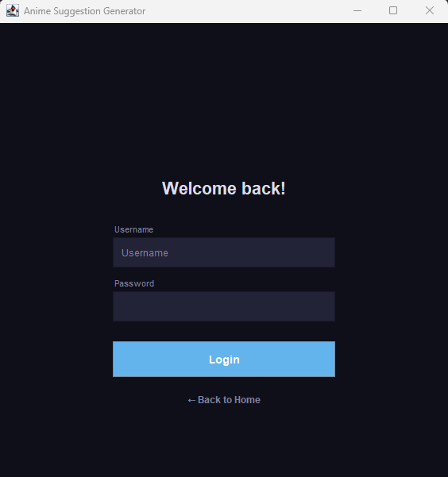
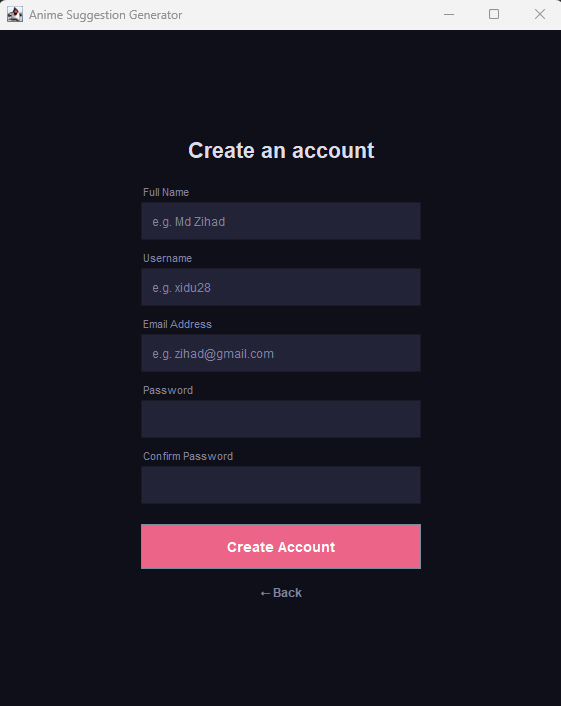
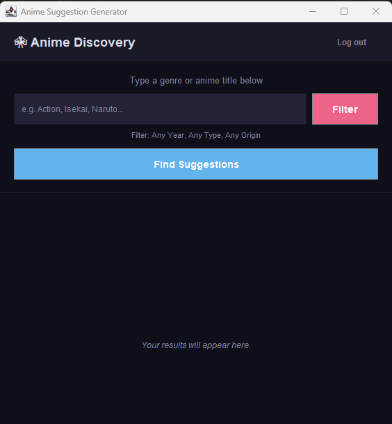
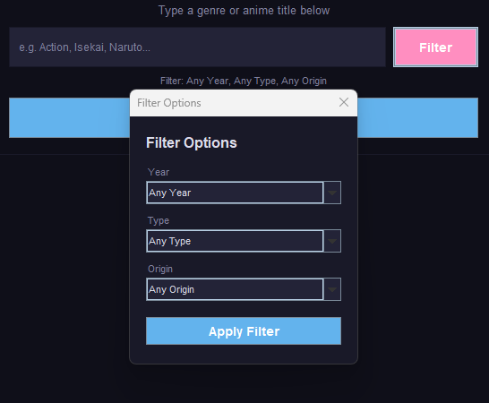
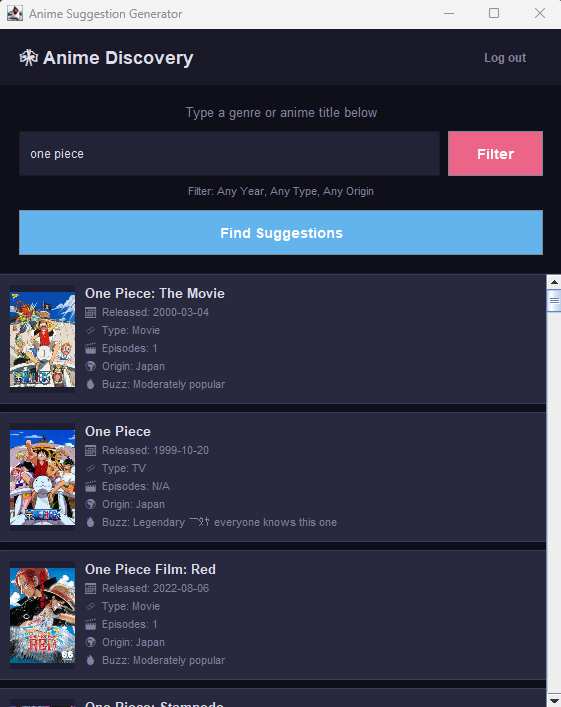

# 🎌 Anime Suggestion Generator

A desktop-based anime discovery application developed using Java Swing. The main purpose of this project is to provide users with an interactive interface where they can search for anime by title or genre, apply filters, and receive suggestions fetched live from an online anime database.

The application includes user authentication, a graphical interface built with Java Swing, a terminal-based interface, genre and keyword search, and filter options for year, type, and origin.

---

## Project Description

Anime Suggestion Generator is a Java desktop application that allows users to create an account, log in securely, and search for anime suggestions powered by the Jikan REST API (MyAnimeList). Results are displayed as visual cards showing the cover image, release date, episode count, type, origin, and popularity of each anime.

The project was developed to explore Java GUI development, object-oriented programming concepts, API integration, file handling, and user authentication systems within a desktop environment.

---

## Features

- User registration system
- User login system
- Anime search by title or genre
- Filter by release year
- Filter by type (TV, Movie, OVA, ONA, Special, Music)
- Filter by origin (Japan, China, South Korea)
- Live data from Jikan API (MyAnimeList)
- Anime cards with cover images, episode count, and popularity
- Terminal-based interface (alternative to GUI)
- Simple and user-friendly dark-themed GUI
- File-based user data storage

---

## Technologies Used

**Programming Language**
- Java

**GUI Framework**
- Java Swing

**Additional Technologies**
- Jikan REST API v4 (MyAnimeList)
- Java File I/O
- Java HTTP networking (HttpURLConnection)
- SwingWorker (asynchronous background tasks)
- Object-Oriented Programming (OOP)

---

## Installation

### Prerequisites

Before running the project, make sure the following are installed:

- Java JDK 11 or later
- Internet connection (required for Jikan API)

### Clone the Repository

```bash
git clone https://github.com/Zihad-28/Anime-Suggestion-Generator-Using-Java.git

cd Anime-Suggestion-Generator-Using-Java
```

### Compile the Project

```bash
javac -d bin src/animesuggestiongenerator/*.java
```

### Run the Application (GUI)

```bash
java -cp bin animesuggestiongenerator.MainApp
```

### Run the Application (Terminal)

```bash
java -cp bin animesuggestiongenerator.MainAppTerminal
```

---

## Usage

### Step 1: Register
Create a new account by entering:
- Full Name
- Username
- Email Address
- Password (minimum 8 characters)

### Step 2: Login
Log in using your registered username and password.

### Step 3: Search for Anime
Enter an anime title or genre keyword in the search field (e.g. Action, Isekai, Naruto).

### Step 4: Apply Filters (Optional)
Click the **Filter** button to narrow results by:
- Release Year
- Type (TV, Movie, OVA, etc.)
- Origin (Japan, China, South Korea)

### Step 5: View Results
Anime suggestions will appear as cards showing the cover image, release date, type, episodes, origin, and popularity.

---

## Project Structure

```
Anime-Suggestion-Generator-Using-Java/
│
├── src/
│   └── animesuggestiongenerator/
│       ├── MainApp.java
│       ├── MainAppTerminal.java
│       ├── AppGui.java
│       ├── TerminalApp.java
│       ├── AnimeEngine.java
│       ├── WebConnector.java
│       ├── FilterMaker.java
│       └── UserManager.java
│
└── user_data.txt
```

---

## Main Components

### Login System
Handles user authentication by reading credentials from a local file and validating the input.

### Registration System
Allows new users to create an account with full name, username, email, and password. Validates for duplicate usernames and emails.

### AnimeEngine Module
Processes user search queries, calls the Jikan API, parses the JSON response, and applies filters before displaying results.

### WebConnector
Handles all HTTP GET requests to the Jikan API. Supports multi-page fetching with a delay to respect API rate limits.

### FilterMaker
Applies year, type, and origin filters to each anime result before it is displayed to the user.

### AppGui
Manages the full graphical user interface including the Welcome, Login, Sign Up, and Search screens using Java Swing with a CardLayout.

### TerminalApp
Provides an alternative text-based interface for users who prefer running the application in the terminal.

### UserManager
Handles reading and writing user account data to a local file, including login validation, duplicate checking, and registration.

---

## Security Features

Current implementation includes:
- User authentication (username and password validation)
- Input validation on registration (email format, password length, duplicate check)
- Session-based screen navigation

Possible future security improvements:
- Password hashing using BCrypt
- Database storage instead of plain text file
- Email verification
- Password recovery system
- Data encryption

---

## Future Improvements

Some planned enhancements include:
- MySQL database integration
- Secure password hashing
- Forgot password feature
- User profile management
- Dark and light theme toggle
- Export search results as PDF or CSV
- Anime watchlist / favourites feature
- Multi-language support
- Better AI-based recommendation engine
- Offline caching of previous search results

---

## Screenshots

**Welcome Screen**



**Login Screen**



**Sign Up Screen**



**Search Screen**



**Filter Dialog**



**Search Results**



---

## Contributing

Contributions are welcome.

To contribute:
1. Fork the repository
2. Create a new branch
3. Make your changes
4. Commit your changes
5. Push the branch
6. Submit a pull request

---

## License

This project is created for educational and learning purposes.

---

## Author

**Md Zihad**

Computer Science and Engineering Student

GitHub: [https://github.com/Zihad-28](https://github.com/Zihad-28)

---

## Conclusion

This project helped improve understanding of Java Swing GUI development, object-oriented programming, REST API integration, user authentication systems, JSON parsing, and file handling. It serves as a practical example of building a fully functional Java desktop application connected to a live online data source.
